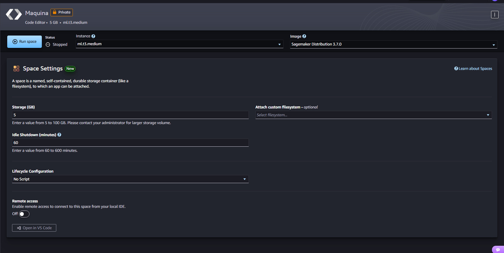

# Stellar Luminosity Prediction using Linear and Polynomial Regression

A comprehensive machine learning project that implements linear and polynomial regression from scratch to predict stellar luminosity based on stellar mass and temperature. This project includes both single-feature linear regression and multi-feature polynomial regression with interaction terms, providing hands-on experience with gradient descent optimization and feature engineering.

## Getting Started

These instructions will get you a copy of the project up and running on your local machine for development and testing purposes. The project was developed and tested using AWS SageMaker, but can also be run locally in any Python environment with Jupyter Notebook support.

### Prerequisites

You need Python 3.8 or higher installed on your system along with the following packages:

```bash
numpy>=1.21.0
matplotlib>=3.4.0
jupyter>=1.0.0
```

### Installing

A step-by-step series of examples that tell you how to get a development environment running:

**Step 1: Clone the repository**

```bash
git clone <repository-url>
cd regresion-lab
```

**Step 2: Create a virtual environment**

```bash
python -m venv .venv
```

**Step 3: Activate the virtual environment**

Windows:
```bash
.venv\Scripts\activate
```

Linux/Mac:
```bash
source .venv/bin/activate
```

**Step 4: Install required packages**

```bash
pip install numpy matplotlib jupyter
```

**Step 5: Launch Jupyter Notebook**

```bash
jupyter notebook
```

**Step 6: Open the notebooks**

Navigate to the project directory and open either:
- `01_part1_linreg_1feature.ipynb` - Linear regression with single feature
- `02_part2_polyreg.ipynb` - Polynomial regression with interaction terms

**Example output:**

After running the first few cells, you should see output similar to:

```
Dataset: 10 stellar observations
M range: [0.6, 2.4] M☉
T range: [3800, 9200] K
L range: [0.15, 35.00] L☉
```

## Running the notebooks

The project consists of two main Jupyter notebooks that demonstrate different regression techniques:

### Part 1: Linear Regression (Single Feature)

**File:** `01_part1_linreg_1feature.ipynb`

This notebook implements linear regression from scratch to predict stellar luminosity (L) based solely on stellar mass (M):

- **Data Exploration**: Visualize the relationship between mass and luminosity
- **Cost Function**: Implement Mean Squared Error (MSE) cost function
- **Gradient Computation**: Both vectorized and non-vectorized implementations
- **Gradient Descent**: Train the model using iterative optimization
- **Visualization**: Cost function contours, 3D surface plots, convergence analysis
- **Model Evaluation**: MSE, RMSE, R² metrics

**Key Results:**
- Achieves R² ≈ 0.98 on stellar data
- Demonstrates the importance of learning rate selection
- Visualizes gradient descent path on cost surface

### Part 2: Polynomial Regression (Multiple Features)

**File:** `02_part2_polyreg.ipynb`

This notebook extends to polynomial regression with interaction terms, predicting luminosity using both mass and temperature:

**Model:** $\hat{L} = w_1 M + w_2 T + w_3 M^2 + w_4 (M \cdot T) + b$

- **Feature Engineering**: Create polynomial and interaction features [M, T, M², M·T]
- **Vectorized Implementation**: Efficient matrix operations using NumPy
- **Model Comparison**: Compare three models (linear, polynomial, full interaction)
- **Sensitivity Analysis**: Analyze importance of interaction coefficient
- **Inference**: Predict luminosity for new stellar observations

**Key Results:**
- Full model (M3) achieves lowest cost (≈4.66)
- Interaction term (M·T) significantly improves predictions
- Successfully predicts luminosity for unseen stellar data

## AWS SageMaker Deployment

This project was developed and tested using AWS SageMaker Studio. Below are screenshots demonstrating the deployment:

### SageMaker Instance Setup


*Figure 1: AWS SageMaker instance configuration showing the machine type and specifications used for training*


*Figure 2: SageMaker instance in running state, ready for notebook execution*

### File Management


*Figure 3: Project files successfully uploaded to SageMaker Studio environment*

### Notebook Execution


*Figure 4: Part 1 notebook (Linear Regression) successfully compiled and executed in SageMaker*


*Figure 5: Part 2 notebook (Polynomial Regression) successfully compiled and executed in SageMaker*

## Built With

* **NumPy** - Numerical computing library for array operations and linear algebra
* **Matplotlib** - Data visualization library for creating plots and charts
* **Jupyter Notebook** - Interactive development environment
* **AWS SageMaker** - Cloud platform used for development and testing

## Project Structure

```
regresion-lab/
├── 01_part1_linreg_1feature.ipynb   # Linear regression implementation
├── 02_part2_polyreg.ipynb           # Polynomial regression implementation
├── regressionfiles/                 # Reference implementation files
│   ├── 01-week1_lab_notebook_1_one_feature_linear_regression_no_vectorization.ipynb
│   ├── 02-week1_vectorization.ipynb
│   ├── 03-week1_lab_notebook_1_one_feature_linear_regression_with_vectorization.ipynb
│   └── 04-week1_lab_notebook_2_multifeature_house_prices.ipynb
├── images/                          # SageMaker deployment screenshots
├── .venv/                           # Virtual environment (not tracked)
├── .git/                            # Git repository
└── README.md                        # This file
```

## Key Features

- **From-scratch implementation**: All algorithms implemented without using scikit-learn
- **Vectorized operations**: Efficient NumPy implementations for fast computation
- **Comprehensive visualization**: 2D/3D plots, contours, convergence curves
- **Multiple models**: Compare linear vs polynomial vs interaction models
- **Real-world data**: Stellar mass, temperature, and luminosity observations
- **Detailed analysis**: Cost surface exploration, gradient verification, sensitivity analysis

## Mathematical Formulations

### Cost Function (MSE)

$$J(w,b) = \frac{1}{2m} \sum_{i=1}^{m} (\hat{y}^{(i)} - y^{(i)})^2$$

### Gradient Descent Updates

$$w := w - \alpha \frac{\partial J}{\partial w}$$

$$b := b - \alpha \frac{\partial J}{\partial b}$$

### Gradients (Vectorized)

$$\frac{\partial J}{\partial w} = \frac{1}{m} X^T (Xw + b - y)$$

$$\frac{\partial J}{\partial b} = \frac{1}{m} \sum_{i=1}^{m} (\hat{y}^{(i)} - y^{(i)})$$

## Versioning

Version 1.0.0 - Initial release with complete linear and polynomial regression implementations

## Authors

* **Your Name** - *Initial work and implementation*

## License

This project is licensed under the MIT License - see the LICENSE.md file for details

## Acknowledgments

* Inspired by Andrew Ng's Machine Learning course
* Stellar data based on astronomical observations of main-sequence stars
* Reference implementations provided in `regressionfiles/` directory
* AWS SageMaker for providing cloud computing resources
* NumPy and Matplotlib communities for excellent documentation

## Additional Notes

### Learning Rate Selection

The project demonstrates the critical importance of learning rate (α) selection:
- Too large: Gradient descent diverges (cost explodes)
- Too small: Convergence is very slow
- Optimal: Smooth, fast convergence

For this dataset with large feature magnitudes (M·T ≈ 22,080), α = 1e-10 was found optimal.

### Feature Scaling Considerations

While not implemented in this version, feature scaling would allow:
- Larger learning rates
- Faster convergence
- Better numerical stability

Future improvements could include:
- Z-score normalization
- Min-max scaling
- Feature standardization